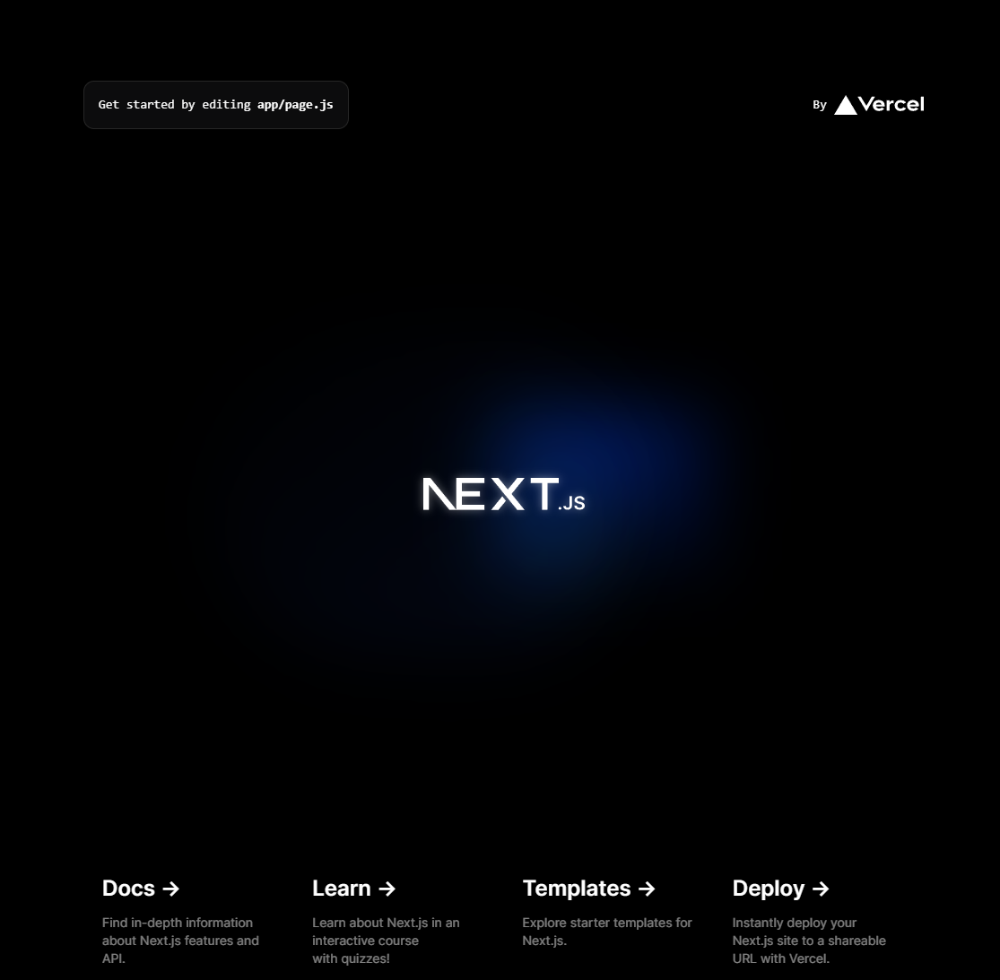

# Creating a New Next.js Project & Tailwind Config

Now we are going to create a new Next.js project as well as implement Tailwind CSS. The easiest way to get started with Next.js is by using `create-next-app`. This is a CLI tool that enables you to quickly start building a new Next.js application, with everything set up for you.

Let's create a folder for our new project. You can do this from within your operating system's file manager or the terminal.

If you use a terminal, navigate to where you want to create the folder and run the following command:

```bash
npx create-next-app@latest property-pulse
```

You will be asked some questions. You can answer them as you see fit. I will answer with the defaults, which are as follows:

```bash
√ Would you like to use TypeScript? ... No
√ Would you like to use ESLint? ... No
√ Would you like to use Tailwind CSS? ... Yes
√ Would you like to use `src/` directory? ... No
√ Would you like to use App Router? (recommended) ... Yes
√ Would you like to customize the default import alias (@/*)? ... No
```

Now cd into the project folder and open the folder in VS Code:

```bash
cd property-pulse
code .
```

Of course, you can use a different editor if you want.

## Directory Structure

Let's go over some of the files and folders that were created for us when we ran the `create-next-app` command.

### `package.json`

Let's take a quick look at the `package.json` file. As far as dependencies, we just have React, ReactDOM and the Next.js framework itself. For dev dependencies, we have the Tailwind CSS framework. We also have and `postcss`, which is required by Tailwind CSS.

For scripts, we have the `dev` script to run the local dev server. The `build` script to build the project for production. The `start` script to start the production server. And the `lint` script to lint the project.

We can go ahead and run the dev server now:

```bash
npm run dev
```

Now visit `http://localhost:3000` in your browser.

You should see a landing page that looks like this:



let's continue with the directory structure.

### `next.config.js`

This is the main config file for our Next.js app. We can use this file to customize the behavior of Next.js. This file is a regular Node.js module, not a JSON file. It gets used by the Next.js server and build phases, and it's not included in the browser build. We don't need to mess with this right now. Later, when we use the Cloudinary service, we will need to add some configuration here.

### `tailwind.config.js`

This file is used to configure Tailwind CSS. The `content` property is used to specify the files that Tailwind CSS should scan for classes. By default, it scans the `pages`, `components` and `app` folders. There are a few theme options that I want to add here. I'll show you that in a minute.

### `public` Folder

This folder is used to store static assets, such as images, fonts, and favicons. Next.js automatically adds caching headers to the assets in this folder.

#### Images

We can add images to this folder and then reference them in our code. This is where site images like the logo will go. Ultimately, we'll be using **Cloudinary** for our property listing images, however we'll use this folder for them when we start out.

### `app` Folder

The `app` folder is where all of our pages and components go. A page is a React component that is associated with a route based on its file name. I'm going to talk about that in the next video. Prior to Next version 13, the pages folder was called `pages`. Now it's called `app` and behaves a bit differently. The `pages.js` file is the homepage. That is what we will see when we run our server. We also have a layout component. This is a component that wraps all of our pages. So you would put things like a header and whatever you want on all of the pages that use that layout. There's also a `globals.css` file for any site-wide CSS. In the next video I'm going to delete the entire app folder so that we can start from scratch and you know exactly what's going on.

## Tailwind Customization (Font & Classes)

We are going to just add a couple things to the `tailwind.config.js` file. The `theme` property is used to customize the default Tailwind CSS theme. For example, we can change the default colors, fonts, and font sizes. I actually do want to add a couple things here. I want to add the default font family of `poppins` and also add an option for a 70/30 layout for our grid. This will just give us a custom class to make one column 70% and the other 30%.

Here is what I want the `tailwind.config.js` file to look like:

```js
/** @type {import('tailwindcss').Config} */
module.exports = {
  content: [
    './pages/**/*.{js,ts,jsx,tsx,mdx}',
    './components/**/*.{js,ts,jsx,tsx,mdx}',
    './app/**/*.{js,ts,jsx,tsx,mdx}',
  ],
  theme: {
    extend: {
      fontFamily: {
        sans: ['Poppins', 'sans-serif'],
      },
      gridTemplateColumns: {
        '70/30': '70% 28%',
      },
    },
  },
  plugins: [],
};
```

As soon as you save the file, the background image will go away. That's fine. We are going to wipe away and re-create the whole app directory in the next lesson anyway.

### Theme Files

As I mentioned in the last lesson, I have included the theme files in the main repo. I am also going to attach a zip folder with the theme files to this lesson. You can download the zip folder and extract the contents wherever you want. I am just going to put the `_theme_files` folder directly into the root of my project. Just drag it over to your structure in VS Code. If there is a popup, select "Copy Folder".

In the next lesson, we will clean up the structure a bit, recreate the `app` folder and also bring over some images from the theme files.
