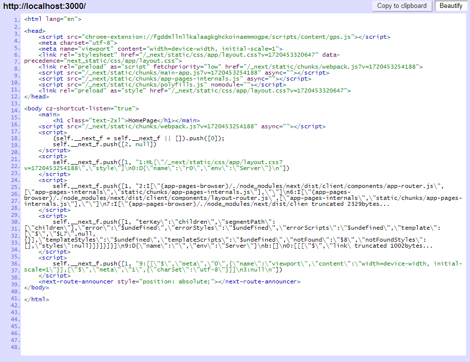

# Metadata, Assets & Git

In this video, we are going to learn how to add metadata to our Next.js application. I also want to bring over the site images from the theme files and make our first Git commit. At the end of this, we'll be deploying to Vercel, so we need to have a Git repo with our code.

## Metadata

By default, there are 2 meta tags in the `<head>` section of the page automatically, without us having to do anything and that is the charset and viewport meta tags.

Let's open the page source of our project and see what's there. I am using the Chrome extension "Quick Source Viewer" to view the source of the page. I highly recommend this as it makes it easy to view the source of the page without having to open the dev tools and it shows all of the assets that are being loaded.



Right now we have a few things in the head section. We have the charset and viewport meta tags. The compiled Tailwind CSS file. Scripts for the main app, preloaded Webpack bundle script, some polyfills and just standard Next.js stuff. I also have some things being put in from some of my Chrome extensions.

Right now, we don't have a page title or keywords or anything like that. We can add any meta tags that we want by just exporting a `metadata` object from the layout.

In your `layout.jsx` file, add the following right under the globals.css import:

```jsx
export const metadata = {
  title: 'PropertyPulse',
  description: 'Find The Perfect Rental Property',
  keywords: 'rental, property, real estate',
};
```

Now if you view the source of the page, you should see the title and description in the `<head>` section.

If you want to add a specific title or meta tag to a page, just export the `metadata` object from that page component. It will override the global metadata.

This is great for SEO because search engines will use this information to display in search results. Unlike a single page application, where the HTML is generated in the browser, Next.js generates the HTML on the server and sends it to the browser. That's why we can see all the content in the source of the page.

## Extra Attributes Error

You may see something like this - `app-index.js:34 Warning: Extra attributes from the server: cz-shortcut-listen,style`. This is usually from using a browser extension that modifies the DOM so it no longer matches the server-rendered content. Most of mine comes from the LastPass extension. You can just ignore this. It's just a warning and does not matter for production.

## Favicon & Image Assets

We have a few things in the theme files that I want to bring over. First, I want the favicon. With Next.js all we have to do is put an image with the name `favicon.ico` in the `app` folder and it will automatically be used as the favicon. So copy and paste the `_theme_files/favicon.ico` into the `app` folder. You may need to do a hard refresh with `Cmd + Shift + R` to see the new favicon.

As for the images, we have a few site images like the logo, but there is also a folder at `_theme_files/images/properties`. These are images for the listings. Ultimately, these will come from a service called Cloudinary, but until we get that setup, we will just use these images.

What we are going to do is first create a folder at `assets/images` and bring all of the theme images except for the `properties` folder into this folder.

Now, the `properties` folder is going to go into the `public/images` folder. This is because we want to serve these images statically. We want to serve them directly from the server. Like I said, later, we will use Cloudinary to serve these images, but for now, we will just use these. So create a folder at `public/images` and copy the `properties` folder into it.

## Commit Your Code

At this point, you should make sure that you initialize a Git repository and commit your code. There is already a `.gitignore` file that has all of the files and folders that you do not want to commit.

#### Add `.env` to `.gitignore`

Open your `.gitignore` file and add `.env` to the bottom of the file. This will prevent your `.env` file from being committed to the repo. This is important because you don't want to expose your secrets to the public.

It is up to you if you want to include the `_theme_files` folder or not. I probably wouldn't include them in the repo because they are not needed for the project to run. They are just there for reference as you take the course. But it's up to you.

You can do this from the command line or from VS Code. I prefer to do it from the command line.

```bash
git init
git add .
git commit -m 'Layout and homepage components'
```

You can push to a remote repo like Github or Gitlab if you want, but I'm just going to keep it local for now.
