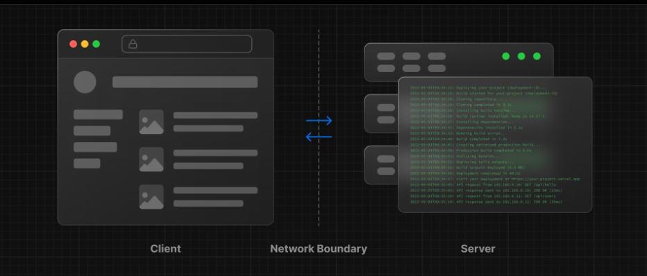
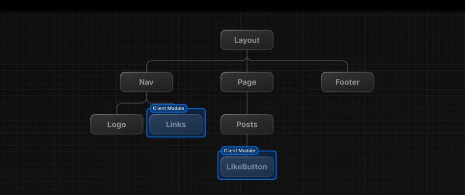

# Server vs Client components

Let's talk more about server vs client components.

Traditionally, when building a React single page application (SPA), all of the components are client components.

Client: When using Next.js, the client receives pre-rendered HTML from the server and then uses JavaScript to enhance the page with interactive features. 

Server: When a user requests a page, the Next.js server can either generate the HTML dynamically (for SSR) or serve pre-built static HTML (for SSG). This process ensures that the user gets a fast and efficient initial load.



Making a component render on the client is as simple as adding the following to the top of the file:

```jsx
'use client';
```

There are pros and cons to both server and client components. For instance, when it comes to data-fetching from a server component, you can reduce the code and complexity of your application. You have direct access to ORMs and databases, and you can use server-side rendering (SSR) to improve SEO. However, when it comes to interactivity, server components can be slower and less interactive than client components. You also can only use React hooks from a client component.

It can be confusing on when to use which, so there is a chart at https://nextjs.org/docs/app/building-your-application/rendering/composition-patterns


## Network Boundary

In Next.js, there is a network boundary between server and client components. You can choose where this boundary is in your component tree. For example, you can fetch data and render a user's posts on the server (using Server Components), but then render the LikeButton for each post on the client (using Client Components). The reason for this is because the like button is interactive and will use events and maybe some hooks and needs to be rendered on the client.

Similarly, you can create a Nav component that's rendered on the server and shared across pages, but if you want to show an active state for links, you can render the list of Links on the client.



Behind the scenes, the components are divided into two groups: server components and client components. After the server components are rendered, the server sends a special data package called the `React Server Component Payload` (RSC) to the client. This package includes:

- The output of the server-rendered components.
- Placeholders indicating where the client components should go, along with references to their JavaScript files.

React then uses this data to combine the server and client components and update the webpage in the browser.

One misconception is that 'use client' is Client Side only. That's not really the case. 'use client' is a hint to the the bundler, that the module has to be part of the JavaScript that is sent to the client. Server Components, never share their JavaScript with the client.

## When To Use Which

It can be confusing on when to use which, so there is a chart at https://nextjs.org/docs/app/building-your-application/rendering/composition-patterns


If you are just fetching some data or need access to backend resources directly, you can usually keep it as a server component. Obviously if you have sensitive data like api keys, you should keep it as a server component, otherwise you risk exposing your keys to the client.

However if you want to add events and hooks and make the component interactive, you should use a client component.

In the next lesson, we'll see how to make a component a client component.
