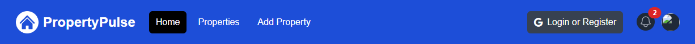

# Navbar Component

Alright so now we are going to start on the navbar component. I'm going to warn you that the Navbar setup will be tedious. We can copy the initial HTML but we need to do a bunch of stuff in order for it to do the things we need such as active links, dropdowns, and conditional rendering of links. I am going to include the finished `Navbar.jsx` component/file in the resource download for this lesson. That way you can just download and include it in your project if you don't want to manually change everything. I would still suggest watching the next 3 videos though so you can see how everything is done.

Let's create a new folder called `components` in the root of our project NOT in the `app` folder. This is where we will put all of our UI components. There is a bit of a debate on whether or not to put the components in the `app` folder or in the root of the project. I prefer to put them in the root of the project because I like to keep the `app` folder for page components and API routes. It's up to you though. Putting them in the `app` folder is perfectly fine.

Create a new file called `Navbar.jsx` in the `components` folder. We'll start by creating a component called `Navbar`:

```jsx
const Navbar = () => {
  return <div>Navbar</div>;
};
export default Navbar;
```

Now we can import the `Navbar` component into the `app/layout.jsx` component:

```jsx
import Navbar from '@/components/Navbar';
```

Put it right above the `<main>` tag:

```jsx
const MainLayout = ({ children }) => {
  return (
    <html lang='en'>
      <body>
        <Navbar />
        <main>{children}</main>
      </body>
    </html>
  );
};
```

You should see the word "Navbar" on all pages. Now we can start building out the navbar.

## Navbar HTML

The navbar HTML can be found in the `_theme_files/index.html` file. You can copy the `nav` tag from that file, however, there are quite a few changes when it comes to HTML vs JSX.

Here are the changes to be made:

- All the `class` attributes need to be changed to `className`.
- For SVG attributes, you need to change the attributes to camelCase. So `stroke-width` to `strokeWidth` and `stroke-linecap` to `strokeLinecap`, etc.
- `tabindex` needs to be changed to `tabIndex`.
- The comments need to be changed to `{/* */}`.
- Import logo and profile image.
- The `` tag needs to be changed to the `<Image>` component from Next.js.

### Change Class to ClassName

First, let's change all of the `class` attributes to `className`. For example, the `<nav>` tag should look like this:

```jsx
 <nav className='bg-blue-700 border-b border-blue-500'>
```

### SVG Attributes

Next, we need to change the SVG attributes to camelCase. For example, the `<svg>` tag should look like this:

```jsx
<svg
  className='block h-6 w-6'
  fill='none'
  viewBox='0 0 24 24'
  strokeWidth='1.5'
  stroke='currentColor'
  aria-hidden='true'
>
  <path
    strokeLinecap='round'
    strokeLinejoin='round'
    d='M3.75 6.75h16.5M3.75 12h16.5m-16.5 5.25h16.5'
  />
</svg>
```

Do a ctrl+f and find and replace all of the attributes. The ones in the page are `stroke-width`, `stroke-linecap`, `stroke-linejoin`, `aria-hidden`, `stroke-linecap`, `stroke-linejoin`. Change them to `strokeWidth`, `strokeLinecap`, `strokeLinejoin`, `ariaHidden`, `strokeLinecap`, `strokeLinejoin` respectively.

### Tabindex

Next, we need to change the `tabindex` attribute to `tabIndex`. There are 4 instances to be changed.

### Comments

Next, we need to change the comments to `{/* */}`. For example, the logo comment should look like this:

```jsx
{
  /* <!-- Logo --> */
}

Just select the comment and hit `ctrl+/`
```

### Image Component & Logo

We will be using the Next.js `Image` component. This component is used to optimize images for the web. It will automatically resize images based on the viewport size. It will also lazy load images which means it will only load the images that are visible on the screen. Let's import that and the `logo-white.png` and `profile.png` image into the `Navbar.jsx` component:

```jsx
import Image from 'next/image';
import logo from '@/assets/images/logo-white.png';
import profileDefault from '@/assets/images/profile.png';
```

Then change the `` tag to the `<Image>` component and add the `src` and `alt` attributes:

```jsx
<Image className='h-10 w-auto' src={logo} alt='PropertyPulse' />
```

Now you should see the logo on the screen.

Also, change the profile image from an `` tag to the `<Image>` component and change the src, width, height attributes:

```jsx
<Image className='h-8 w-8 rounded-full' src={profileDefault} alt='' />
```

We will replace it with the actual image later.

It should look something like this:



In the next lesson, we will add the links, dropdowns and icons.
