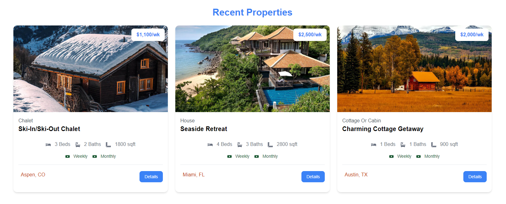

# Homepage Properties Component

Now that we have our properties page looking good, let's move on to the homepage. We want to display the properties on the homepage as well. We will use the same `PropertyCard` component that we created in the last section, however, we want to limit it to 3 properties. We will also want to randomize the properties so that we don't always see the same ones.

In addition, we will also have featured properties that will have a slightly different style. We will create a `FeaturedPropertyCard` component for that.

Creating a new component called `components/HomeProperties.jsx`. Add the following:

```js
import properties from '@/properties.json';
import PropertyCard from './PropertyCard';

const HomeProperties = () => {
  return (
    <section class='px-4 py-6'>
      <div class='container-xl lg:container m-auto'>
        <h2 class='text-3xl font-bold text-blue-500 mb-6 text-center'>
          Recent Properties
        </h2>
        <div class='grid grid-cols-1 md:grid-cols-3 gap-6'>
          {properties.map((property, index) => (
            <PropertyCard property={property} key={index} />
          ))}
        </div>
      </div>
    </section>
  );
};

export default HomeProperties;
```

## Limit Properties

This will show all properties on the homepage. We want to limit it to 3. Let's add the following:

```js
import properties from '@/properties.json';
import PropertyCard from './PropertyCard';

const HomeProperties = () => {
  const recentProperties = properties
    .sort(() => Math.random() - Math.random())
    .slice(0, 3);

  return (
    <section class='px-4 py-6'>
      <div class='container-xl lg:container m-auto'>
        <h2 class='text-3xl font-bold text-blue-500 mb-6 text-center'>
          Recent Properties
        </h2>
        <div class='grid grid-cols-1 md:grid-cols-3 gap-6'>
          {recentProperties.map((property, index) => (
            <PropertyCard property={property} key={index} />
          ))}
        </div>
      </div>
    </section>
  );
};

export default HomeProperties;
```

Now you should only see 3 properties on the homepage.



## If No Properties

We should also make it so it shows a message if there are no properties. Let's add the following:

```js
<div className='grid grid-cols-1 md:grid-cols-3 gap-6'>
  {recentProperties.length === 0 ? (
    <p>No Properties Found</p>
  ) : (
    recentProperties.map((property) => (
      <PropertyCard key={property._id} property={property} />
    ))
  )}
</div>
```

you can test this by changing the `recentProperties` to an empty array:

```js
const recentProperties = [];
```

## View all properties

Let's also add a button to view all properties. Add a fragment around the section and add the following under the section:

```js
<section className='m-auto max-w-lg my-10 px-6'>
  <Link
    href='/properties'
    className='block bg-black text-white text-center py-4 px-6 rounded-xl hover:bg-gray-700'
  >
    View All Properties
  </Link>
</section>
```

You also need to import `Link` from `next/link`:

```js
import Link from 'next/link';
```

Now you should see a button to view all properties.
