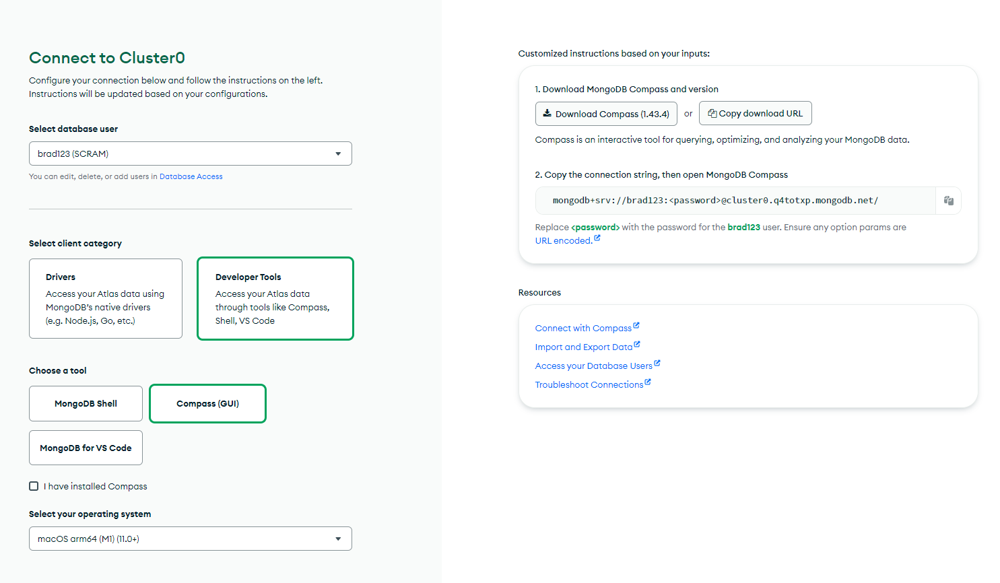
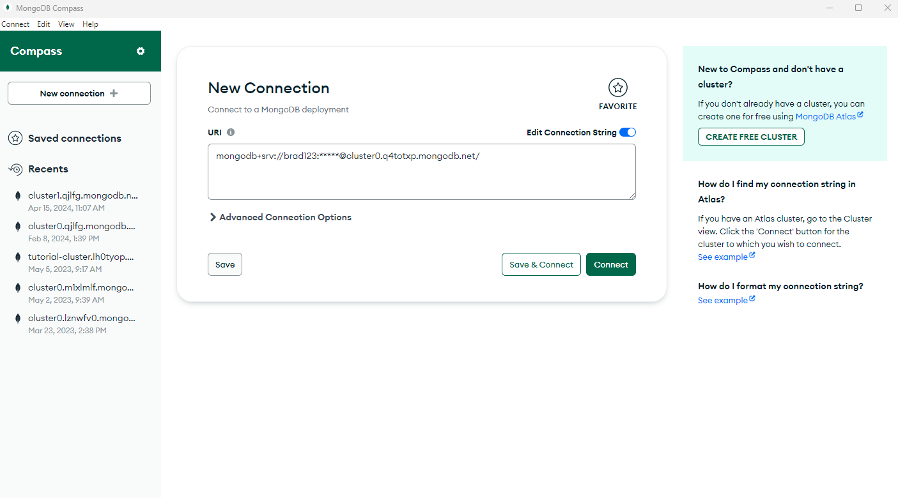
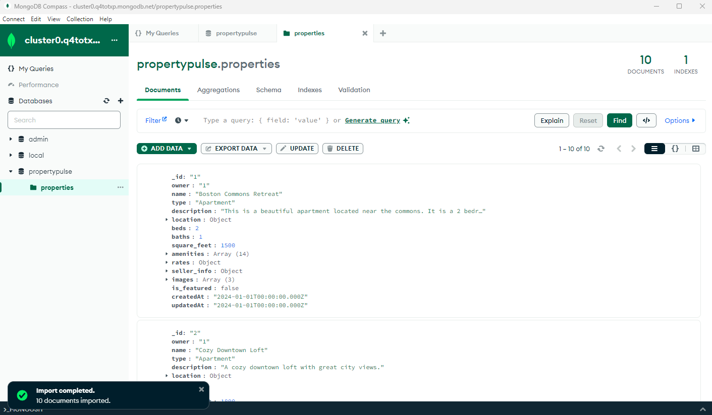

# Compass and Import Data

We now have our database created and connected to our application. Now we need to import some data into our database. We will use MongoDB Compass to do this. Compass is a desktop application that allows you to view and edit your MongoDB data. It is not required, but it is a nice tool to have.

You can download it from https://www.mongodb.com/try/download/compass. Once you have it installed, open it up.

We need to get our connection data for Compass. Log into Atlas and click on "Connect". Then click on "View Full Instructions". You will see a page like the following.



Select "Developer Tools" and "Compass GUI", then copy the connection string.

It will look like this:

```
mongodb+srv://<username>:<password>@cluster0.q4totxp.mongodb.net/
```

Replace the username and password.

Open the Compass desktop tool and enter the connection string. It should look something like this:



Click "Connect".

You should then see your "propertypulse" database. Click on that and you should see the "properties" collection.

## Importing Data

We are going to use the same `properties.json` file that we are now rendering from to import the data BUT we need to remove the `_id` field from each document. The `_id` field is automatically generated by MongoDB and we don't want to overwrite it. So delete each `_id` field from the `properties.json` file.

In Compass, click on the "properties" collection. Under the "Documents" tab you should see a button that says "Add Data". Click on that and select "Import JSON or CSV File" and select the `properties.json` file. Click "Next" and then "Import". You should see your imported data.



In the next lesson, we will connect to our database from our application.
