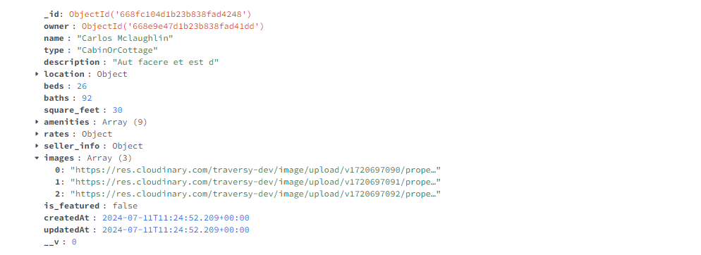
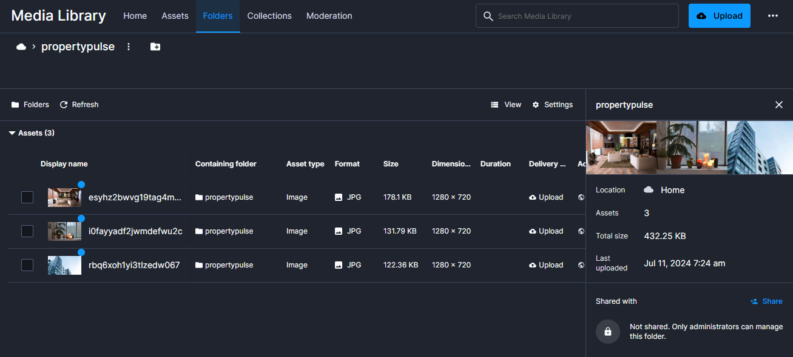

# Cloudinary Image Upload

For uploading images, we are going to use the Cloudinary service. There are a few ways to do this. We could do everything from the client but we run into the issue of security of our keys. So I want to do it all from the API route on the server.

## Cloudinary Account

First, you need to have a Cloudinary account. You can create a free account at [https://cloudinary.com/users/register/free](https://cloudinary.com/users/register/free).

## Cloudinary Env Variables

After creating your Cloudinary account, you need to get your Cloudinary settings. Click on the gear icon in the bottom left. The interface may be a bit different depending on when you are reading this, but you should be able to find the settings.

We need to find three things. The first is the cloud name. The second is the API key. And the third is the API secret.

Click on the "Account" tab on the left. You should see the cloud name. Copy it and paste it in the `.env` file as the value of the `CLOUDINARY_CLOUD_NAME` variable.

Then click on "Access Keys" and click "Generate new access key" and get the API key and secret. Your `.env` file should look like this:

```bash
CLOUDINARY_CLOUD_NAME=your_cloud_name
CLOUDINARY_API_KEY=your_api_key
CLOUDINARY_API_SECRET=your_api_secret
```

## Cloudinary Node.js SDK

We need to install the Cloudinary Node.js SDK. Run the following command:

```bash
npm install cloudinary
```

## Config file

We need to initialize the Cloudinary SDK. Instead of doing that within the API route, let's create a new file at `config/cloudinary.js`. We will put the initialization code in there.

```js
import { v2 as cloudinary } from 'cloudinary';

cloudinary.config({
  cloud_name: process.env.CLOUDINARY_CLOUD_NAME,
  api_key: process.env.CLOUDINARY_API_KEY,
  api_secret: process.env.CLOUDINARY_API_SECRET,
});

export default cloudinary;
```

Now open the the `app/actions/addProperty.js` file. We need to import the Cloudinary SDK and the config file.

```js
import cloudinary from '@/config/cloudinary';
```

## Image Array

We need to change the images data to be an array of image objects rather than just the name. So replace it with the following:

```js
const images = formData.getAll('images').filter((image) => image.name !== '');
```

We got rid of the `map` function and just kept the `filter` function to remove any empty images. This will give us an array of image objects.

Now, delete the `images` property from the `propertyData` object. This is because we are going to upload the images to Cloudinary and then add the Cloudinary URL to the property data.

```js
const propertyData = {
  // ...
  images, // Remove this line
};
```

Add the following code under the `propertyData` object:

```js
const imageUrls = [];

for (const imageFile of images) {
  const imageBuffer = await imageFile.arrayBuffer();
  const imageArray = Array.from(new Uint8Array(imageBuffer));
  const imageData = Buffer.from(imageArray);

  // Convert the image data to base64
  const imageBase64 = imageData.toString('base64');

  // Make request to upload to Cloudinary
  const result = await cloudinary.uploader.upload(
    `data:image/png;base64,${imageBase64}`,
    {
      folder: 'propertypulse',
    }
  );

  imageUrls.push(result.secure_url);
}

propertyData.images = imageUrls;
```

Here, we are looping through the images and converting them to base64. We then upload the image to Cloudinary and push the secure URL to the `imageUrls` array. Finally, we add the `imageUrls` array to the `propertyData` object. So in our database, we will have an array of image URLs.

## Upload Images

Now fill out the form to add a property and add some images. When you submit the form, it will redirect you to the property page, however you won't see the images yet. because we need to change the path within the component to use the Cloudinary URL.

Open up Compass or Atlas and look at the new listing. You should have an array of Cloudinary URLs for the images.



You should also see the images in the Cloudinary dashboard.



In the next lesson, we will display the images.
