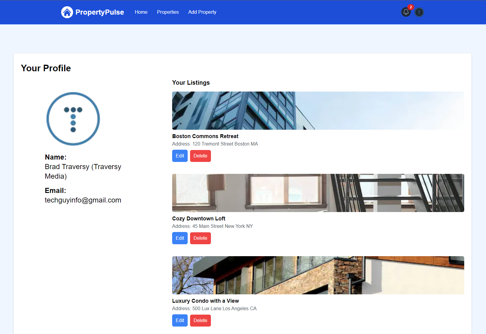

# Profile Listings Component

We want to have the user properties in a second component. Let's create a component at `components/profileProperties.jsx`.

Add the following:

```jsx
const ProfileProperties = ({ properties: initialProperties }) => {
  const [properties, setProperties] = useState(initialProperties);

  return properties.map((property) => <div>property</div>);
};

export default ProfileProperties;
```

We are taking in the properties and renaming that prop to `initialProperties`. We are setting the properties in state and then returning a div for each property.

We are putting them into state because we will be deleting properties and we want to update the UI when that happens.

Go back to the `app/profile/page.jsx` file and bring in the new component:

```jsx
import ProfileProperties from '@/components/ProfileProperties';
```

Under the `<h2>` with the 'Your Listings' heading, copy one of the listings. It starts with `<div className='mb-10'>`. Then place that in the new component return.

It should look like this:

```jsx
const ProfileProperties = ({ properties: initialProperties }) => {
  const [properties, setProperties] = useState(initialProperties);

  return properties.map((property) => (
    <div className='mb-10'>
      <a href='/property.html'>
        
      </a>
      <div className='mt-2'>
        <p className='text-lg font-semibold'>Property Title 1</p>
        <p className='text-gray-600'>Address: 123 Main St</p>
      </div>
      <div className='mt-2'>
        <a
          href='/add-property.html'
          className='bg-blue-500 text-white px-3 py-3 rounded-md mr-2 hover:bg-blue-600'
        >
          Edit
        </a>
        <button
          className='bg-red-500 text-white px-3 py-2 rounded-md hover:bg-red-600'
          type='button'
        >
          Delete
        </button>
      </div>
    </div>
  ));
};

export default ProfileProperties;
```

Now replace the main wrapper for the listings in the profile page with the following. It starts with ` <div className='md:w-3/4 md:pl-4'>`:

```jsx
<div className='md:w-3/4 md:pl-4'>
  <h2 className='text-xl font-semibold mb-4'>Your Listings</h2>
  {properties.length === 0 ? (
    <p>You have no property listings</p>
  ) : (
    <ProfileProperties properties={properties} />
  )}
</div>
```

We are checking for properties. If the user has no properties, we will show a message. If they do, we will show the properties. We are passing them in as a prop.

Right now, you will just see the hard coded data.

Now we can import the Image and Link components and replace the hard coded data with the actual data from the database.

```jsx
import Image from 'next/image';
import Link from 'next/link';

const ProfileProperties = ({ properties: initialProperties }) => {
  const [properties, setProperties] = useState(initialProperties);

  return properties.map((property) => (
    <div key={property._id} className='mb-10'>
      <Link href={`/properties/${property._id}`}>
        <Image
          className='h-32 w-full rounded-md object-cover'
          src={property.images[0]}
          alt=''
          width={500}
          height={100}
          priority={true}
        />
      </Link>
      <div className='mt-2'>
        <p className='text-lg font-semibold'>{property.name}</p>
        <p className='text-gray-600'>
          Address: {property.location.street} {property.location.city}{' '}
          {property.location.state}
        </p>
      </div>
      <div className='mt-2'>
        <Link
          href={`/properties/${property._id}/edit`}
          className='bg-blue-500 text-white px-3 py-3 rounded-md mr-2 hover:bg-blue-600'
        >
          Edit
        </Link>
        <button
          className='bg-red-500 text-white px-3 py-2 rounded-md hover:bg-red-600'
          type='button'
        >
          Delete
        </button>
      </div>
    </div>
  ));
};

export default ProfileProperties;
```

You should now see all the listings for that user.


